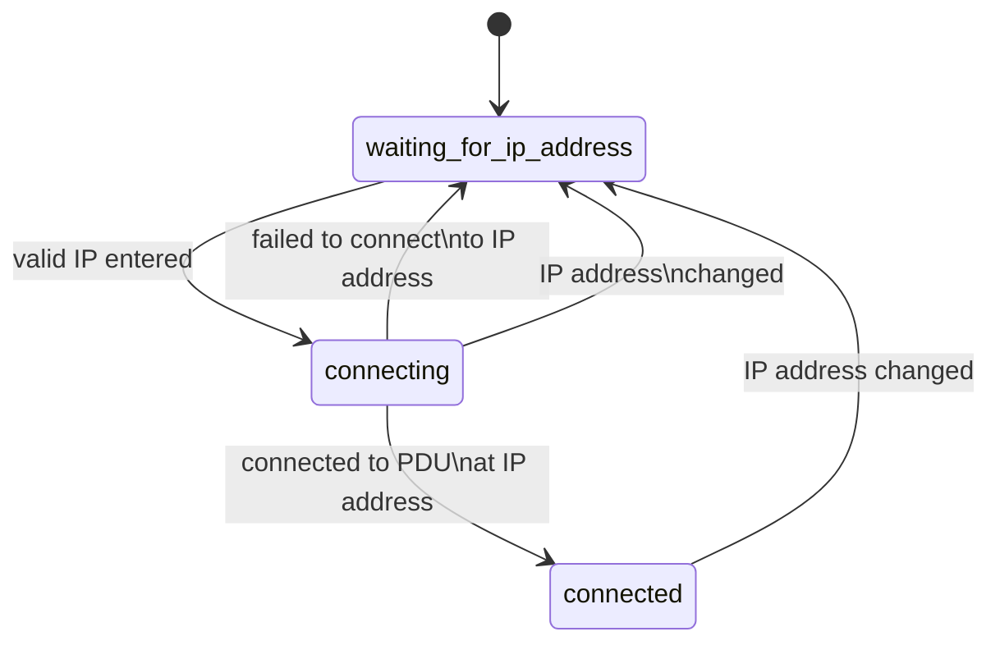

# CyberPower PDU

This is a Python library for interacting with a [CyberPower Power Distribution Unit (PDU)](https://www.cyberpowersystems.com/products/pdu/).

## SNMP

To programmatically remote control a CyberPower PDU, one must use SNMP (simple network management protocol) over Ethernet. The various queries and commands that can be executed via SNMP for a given target are often included in an MIB (management information base) file. [For the CyberPower PDU, the MIB file can be found on their website](https://www.cyberpowersystems.com/products/software/mib-files/). The MIB file will contain human readable names and OID (object identifiers), which are a sequence of numbers, corresponding to the human readable names. In this library, the OIDs are directly used, which removes the need to manage the MIB file in code other than looking up various queries and commands available when developing. See the implementation for which OIDs are used, their corresponding names, and the MIB version that they were obtained from.

To view MIB files, find an MIB browser. One such browser is [MIB Browser by iReasoning](https://www.ireasoning.com/mibbrowser.shtml). Open the browser, select `File -> UnLoad MIBs` and then select all MIB files and hit `Ok`, and then select `File -> Load MIBs` and navigate to the CyberPower MIB file.

## SNMP library selection

Python has several SNMP libraries, but they each have their various tradeoffs.

* :white_check_mark: [**`pysnmp-lextudio`**](https://pypi.org/project/pysnmp-lextudio/): This was chosen because it is an up to date, seemingly maintained as of writing, library that is written in pure Python and has a decently understandable interface. That makes importing it as a dependency quite easy and ensure that it is cross-platform. It is a fork of the `pysnmp` package. Also, this library does not require loading and compiling an MIB file when just using the OIDs directly.

* :x: `pysnmp`: This is the package that `pysnmp-lextudio` was forked from but is no longer maintained.

* :x: `easysnmp`: Despite the name, this package returned several segmentation faults while testing the `set` functionality, which is why this library was not chosen. Additionally, it requires specific external system libraries to be installed, which makes it less portable and harder to install.

* :x: `net-snmp`: These are apparently "official" bindings for Python for SNMP, but the library is very low-level.

## GUI

The GUI implemented in `gui.py` implements the following state machine using Qt's State Machine framework. [See the documentation for PySide2](https://doc.qt.io/qtforpython-5/overviews/statemachine-api.html) since good expository documentation for PySide6 doesn't exist for the State Machine framework yet.

Run the GUI with:

```bash
poetry run python ./cyberpower-pdu/gui.py`
```



## OID listing

In SNMP communication, object identifiers (OIDs) are used to specify the specific data to get/set in an SNMP request. The following are the relevant OIDs currently used in this API. If more are added, this table should be updated. The OIDs come from the `CyberPower_MIB_v2.11.mib` file.

| OID                                          | Name                             | Value   | Type | Description |
| -------------------------------------------- | -------------------------------- | ------- | ---- | ----------- |
| `.1.3.6.1.4.1.3808.1.1.3.3.1.3.0`            | `ePDUOutletDevNumCntrlOutlets`   | n/a     | get  | Gets the number of controllable outlets on the PDU |
| `.1.3.6.1.4.1.3808.1.1.3.2.1.4.0`            | `ePDULoadDevNumBanks`            | n/a     | get  | Gets the number of power banks on the PDU. Power banks are a collection of outlets and associated with an independent power supply |
| `.1.3.6.1.4.1.3808.1.1.6.5.4.1.5.<outlet>`   | `ePDU2BankStatusLoad`            | n/a     | get  | Gets the current electrical load, in tenths of amps represented as an integer, of the given bank |
| `.1.3.6.1.4.1.3808.1.1.3.3.5.1.1.4.<outlet>` | `ePDUOutletStatusOutletState`    | n/a     | get  | Gets the enabled (i.e., on or off) of the given outlet. `<outlet>` is a 1-indexed integer value that specifies which outlet to control and runs from 1 to the number of controllable outlets. A response of `1` is on/enabled and `2` is off/disabled. |
| `.1.3.6.1.4.1.3808.1.1.3.3.3.1.1.4.<outlet>` | `ePDUOutletControlOutletCommand` | command | set  | Sets the enabled (i.e., on or off) of the given outlet. `<outlet>` is a 1-indexed integer value that specifies which outlet to control and runs from 1 to the number of controllable outlets. Values: `1` for immediate on, `2` for immediate off, `3` for immediate reboot. |
