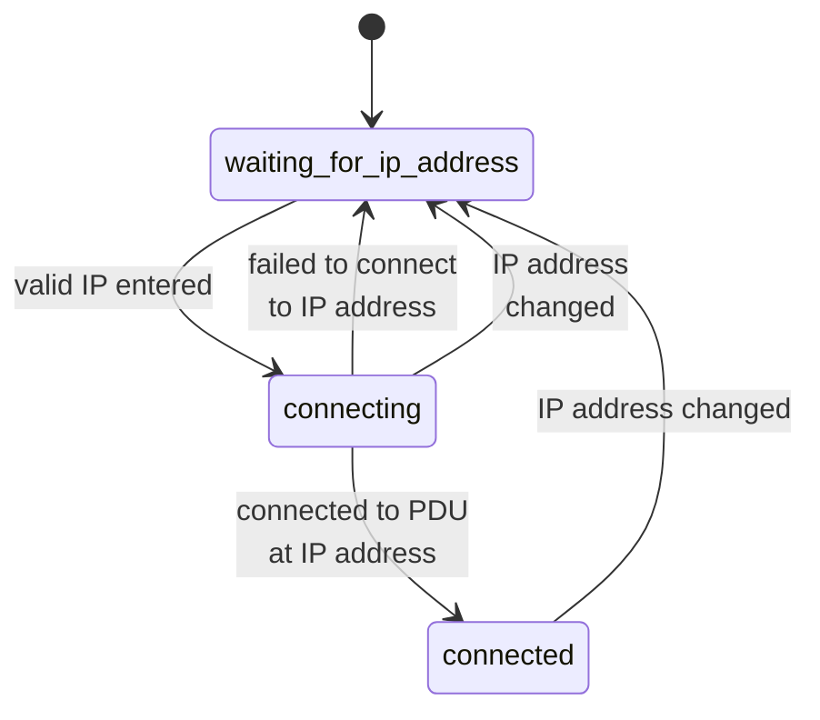

# CyberPower PDU

This is a Python library for interacting with a [CyberPower Power Distribution Unit (PDU)](https://www.cyberpowersystems.com/products/pdu/). It uses [Poetry](https://python-poetry.org) for packaging and dependency management. To get started, make sure you have [poetry installed](https://python-poetry.org/docs/#installation), clone the repository, and install the dependencies.

```shell
git clone https://github.com/mit-kavli-institute/python-cyberpower-pdu.git
cd python-cyberpower-pdu
poetry install
```

## GUI

> [!CAUTION]
> The GUI is not functional at the moment. Previously, the GUI was implemented using a synchronous library. Now that only an asynchronous library exists, the GUI has not been fully updated to work with this.

The GUI implemented in `gui.py` implements the following state machine using Qt's State Machine framework. [See the documentation for PySide2](https://doc.qt.io/qtforpython-5/overviews/statemachine-api.html) since good expository documentation for PySide6 doesn't exist for the State Machine framework yet.

Run the GUI with:

```bash
poetry run python ./cyberpower-pdu/gui.py`
```


```mermaid
stateDiagram-v2
    [*] --> waiting_for_ip_address
    waiting_for_ip_address --> connecting: valid IP entered
    connecting --> waiting_for_ip_address: failed to connect<br>to IP address
    connecting --> waiting_for_ip_address: IP address<br>changed
    connecting --> connected: connected to PDU<br>at IP address
    connected --> waiting_for_ip_address: IP address changed
```
